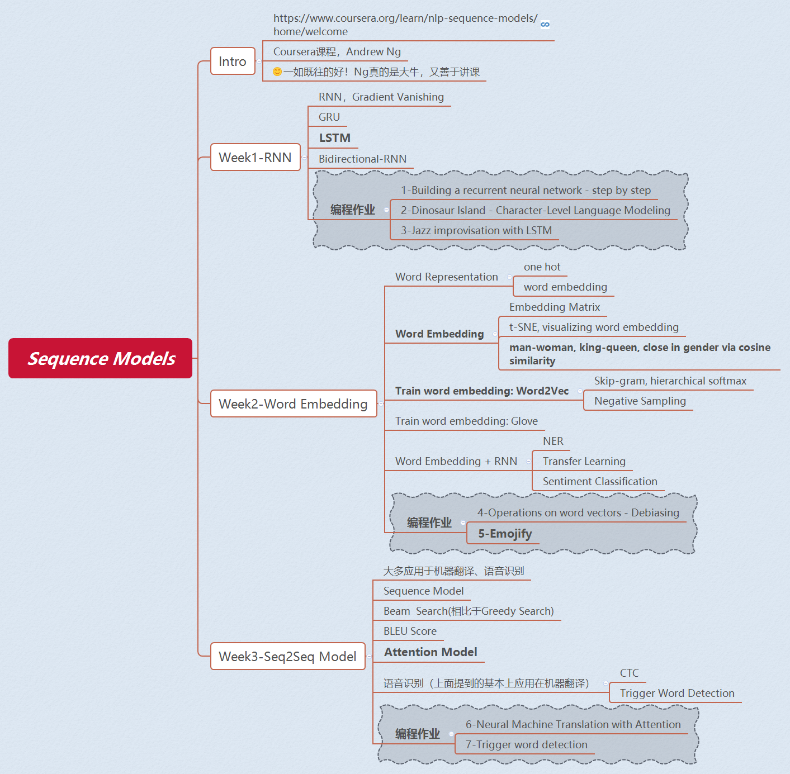
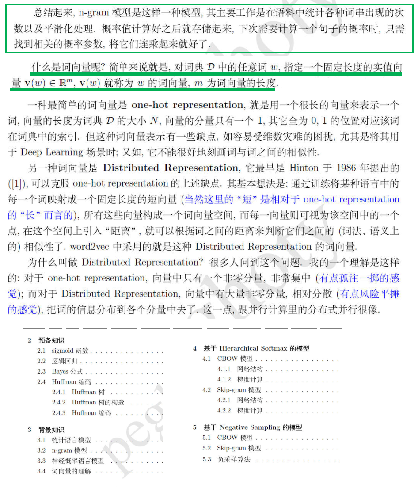

# DataProcBeginner
入门文本处理和分析，包括且不限于：文本挖掘、自然语言处理（统计学基础&深度学习inNLP&常见应用）、机器学习（分类等）、爬虫、正则表达式。  
**（原创笔记）**

## √《深度学习入门之PyTorch》
书中所有代码：[code-of-learn-deep-learning-with-pytorch](https://github.com/L1aoXingyu/code-of-learn-deep-learning-with-pytorch)  
**Note：[deep_learning_with_pytorch_note](./deep_learning_with_pytorch_note/)**，参考此书内容和作者的开源代码，对部分实现（Logistic Regression、RNN）等重新编排而成。  
此书亮点： 1，循序渐进，而且有对应的pytorch代码（jupyter notebook的形式 + Python3） 2，全是干货，理论&code，适合入门者   
>通过看书看代码有几点感受：
>- 同样也听了一些很好的开源课，但欠缺自我思考、总结，也就是没有主动学习，偏被动学习，只有听，没有思考和实践。所以这些理论知识对我而言是悬浮的，没有稳固的基础。
>- 眼高手低，缺乏实践，这不是好的学习方法。
>- Tips：后续如果再听开源课时，通过实际行动改变这种被动学习的惰性。  

注：已经完成这本入门书的第一次学习，但还是很简易的知识点。(done~2019/5/8)  
知识点：1)初步了解PyTorch；2)深度学习基础；3)RNN；4)PyTorch实践。  
**附：Learn by Doing，PyTorch官方教程，好资源： [PyTorch Tutorials](https://pytorch.org/tutorials/#)**

## √ RNN/LSTM
**Note：[RNN_LSTM_Note](./rnn_lstm/)**  
必须掌握的深度学习方法，尤其对NLP而言。通过Note中列出的一些参考资料（很棒），第一次对RNN和LSTM有了一定的理解。

## √ Sequence Models - Coursera
[Sequence Models - Coursera](https://www.coursera.org/learn/nlp-sequence-models/home/welcome)  
共有7个编程作业，完成了其中的一个：[Emojify-Assignment5](rnn_lstm/Emojify-Assignment5)，涉及到词向量、Softmax、LSTM等。  
- 文本分类器，一句话对应一个Emoji符号
- Baseline，Word Vector + Softmax
- Version 2，2层LSTM（Keras) + Softmax + Word Vector + Padding
- 参考资料：[zeeshan87/sequence-models](https://github.com/zeeshan87/sequence-models)
- 需要安装keras、tensorflow等，词向量glove.6B.50d.txt下载较慢  
> Good Exercise，对：1)如何在深度学习中使用词向量有了解；2）如何用LSTM+词向量做文本分类有了解  

## HSE-Natural Language Processing-Coursera
俄罗斯国立高等经济大学的[自然语言处理课程](https://www.coursera.org/learn/language-processing)  
课程对应的代码，[官方Github](https://github.com/hse-aml/natural-language-processing)。
本课程适合对自然语言处理（机器学习、NLP常见应用）有一定了解的人学习。课程简洁明了，短小精悍，既包含对理论的介绍，也有很多应用、实践，尤其是课程的作业。  
课程笔记：[HSE_NLP_Note](./hse_nlp/)  
课程简介如下，包括：传统NLP、深度学习、文本分类、语言模型、序列标注、语义表示、对话系统等。
- Week 1，Intro and text classification
- Week 2，Language modeling and sequence tagging
- Week 3，Vector Space Models of Semantics
- Week 4，Sequence to sequence tasks
- Week 5，Dialog systems  

注： 本课程是 高级机器学习 专项课程的一部分(a part of Advanced Machine Learning of National Research University Higher School of Economics)，可参考Coursera课程页面。

## √ 正则表达式
**Note:** [regex](./regex/readme.md)，包括正则表达式的语法，以及Python正则表达式实践。  
- 在工作中遇到的一个问题的解决方法: [demo_regex.py](./regex/demo_regex.py)，用到了正则表达式中的：位置匹配、子表达式、回溯引用等语法。  
- 在学习英语的时候，想看纯英文字幕，但英文字幕的timeline是不准确的，而纯中文字幕的timeline是OK的，所以写了一个脚本，可以将英文字幕的字幕内容和中文字幕的时间轴合并成新的字幕文件。参看： [srt_adjust.py](./regex/srt_adjust/srt_adjust.py)

## √《从零开始学Python网络爬虫》
**Note： [crawler_python_from_scratch.ipynb](./crawler_python_from_scratch/crawler_python_from_scratch.ipynb)**  
**实践：[爬取NLPJOB网站的职位](./crawler_python_from_scratch/nlpjob/nlpjob_crawler.py)**，URL：[NLPJOB网站](http://www.nlpjob.com/jobs)  
 >很基础的知识框架，Python爬虫相关的工具方法都提到了，但理论知识点到为止，不够详细。  
 >**优点：爬虫实例很多，有代码，容易上手，可理解爬虫的基本理论和常见方法。**  
 > 此书是一本和书名完全契合的、从零开始入门Python爬虫的书。

## 文本挖掘与分析
课程&学习笔记：[text-mining-and-analytics-coursera](./text-mining-and-analytics-coursera/README.md)

## √ SVM（支持向量机）
- **强烈推荐：[SVM Tutorial](https://www.svm-tutorial.com/)**   
通过认真通读这本电子书，对SVM有了比较清晰的理解，虽然公式会淡忘。这主要是因为这本书从最基础的数学和问题出发，沿着很清晰的脉络，循序渐进的讲解：问题是什么？为什么要这么做？怎么做。所以对穿插其中的很多数学公式和理论就不那么糊涂了。
- 在读了前面提到的这本书之后，再去读任何SVM的中文技术博客，都很容易理解。  
此处推荐也很不错的一篇文章：[学习SVM，这篇文章就够了！](https://mp.weixin.qq.com/s?__biz=MzI4MDYzNzg4Mw==&mid=2247487755&idx=1&sn=22b1e130bdbf8657b61aba492fdc6b7d&chksm=ebb429dfdcc3a0c95b4dd6281639277b165cfdd28234e45cb3f2feb8d2158e50e951d681524c&mpshare=1&scene=24&srcid=02223jFOWQgkXSTxor58Tvgt#rd)
- **代码实践**  
**代码：[svm code](./svm/README.md)**。  
借鉴开源代码或工具，用三种方式实现SVM，作为练习，分别是：①SVM的python实现；②sklearn；③libsvm。

## √ 词向量
常常听到词向量、word2vec，其实两者不是一回事。  
**神经网络模型生成的词表示通常被称为词向量(word embedding)**，而Word2Vec是Google于2013年发布的一个用于获取Word Embedding的工具包。  
作为一个小白，最开始着重理解这几点：  
> - 词向量是什么？理论发展过程、优点、用途等  
①词向量是由神经网络模型得到的低维实数向量表示，对上下文、以及上下文与目标词之间的关系进行建模，因此在词向量中包含更丰富的语义信息。  
②从历史上看，早期的词向量只是神经网络语言模型的副产品。词向量的发展，先是有几种神经网络语言模型，然后发展为专门用于生成词向量的神经网络模型。  
③具体发展过程介绍（略），优点、用途（略，待后续实践具体应用）  
> - word2vec的基本工作原理  
①word2vec是训练词向量的一个工具包。  
②word2vec的训练方法有两种模型。同时，为了优化计算效率，又有两种优化方法。  
③简单了解两种模型：CBOW & Skip-gram。暂时略去两种优化方法：Hierarchical Softmax & Negative Sampling。  
> - 汇总介绍：[自然语言处理(四)神经网络语言模型及词向量](https://cloud.tencent.com/developer/article/1384565)

阅读了以下资料，都是干货。
- [word2vec概述](http://jermmy.xyz/2017/11/03/2017-11-3-word2vec-introduction/)  
  - Count Vector没有语义信息，很难用基于频率的方法体现词之间的相似性。  
  - 什么是词的语义呢？***词的语义由其上下文决定，上下文相似的词，其语义也相似。*** word2vec基于语料库，训练一个神经网络，用网络的参数作为文本的特征。word2vec有CBOW和Skip-gram两种模型进行训练。  
  - CBOW用上下文（上下文各词词向量的平均值）预测目标词，神经网络的结构很简单，输入层（V\*1）+隐藏层+softmax输出层(V\*1)，其中输出层中概率最大的位置，对应了目标词在one-hot向量中的位置。输入层-隐藏层的权重矩阵为W1(N\*V)，上下文各个词在隐藏层的输出的平均值作为最终的隐藏层，利用了上下文，**隐藏层-输出层的权重矩阵W2（V\*N）。训练结束后，W2矩阵就是词向量，每一行代表了一个词的向量表示。**  
  - Skip-gram用上下文中某一个词预测上下文，神经网络结构与CBOW相同。最后**输入层-隐藏层的权重矩阵就是词向量。**

- **[word2vec 中的数学原理详解](https://www.cnblogs.com/peghoty/p/3857839.html)**，写得非常好，收获很大！（P.S.也想有这种弄懂了一个知识点之后的写作风格）  
从目录就可以看出这篇文章的行文思路非常清晰，很适合本人这种小白阅读。同时，也提醒自己，**要把对机器学习、深度学习、统计学、NLP中的语言模型等的理解和各个知识点串联起来，形成自己的知识体系，有比较系统的知识框架**。做到这一点，才能把自己和别人讲明白，真正做到能够分享知识的水平。  
该文已经存档，存放在doc/目录，后续不断深入理解和学习。  

  

- [来斯惟. 基于神经网络的词和文档语义向量表示方法研究[D]. 2016.](https://arxiv.org/abs/1611.05962)

## √ 贝叶斯公式 & 最大似然估计 & 最大后验概率估计
 - 参考资料  
[贝叶斯估计、最大似然估计、最大后验概率估计](https://www.jianshu.com/p/9c153d82ba2d)  
[最大似然估计](https://mp.weixin.qq.com/s?__biz=MzI4MDYzNzg4Mw==&mid=2247487202&idx=1&sn=1f3c22a6e16f5611cfe92356ccc0ff74&chksm=ebb43636dcc3bf20892295a5570ed89a533172ad557b2bcf2925ba6848dfacfcf7997d18691d&scene=21#wechat_redirect)  
[最大后验概率估计](https://mp.weixin.qq.com/s?__biz=MzI4MDYzNzg4Mw==&mid=2247487221&idx=2&sn=3f8b6a65276f34adb9ee35322ace7d09&chksm=ebb43621dcc3bf37d3708be73bb1945f579992bbc05358157f46d23b48713768332db8431639&scene=21#wechat_redirect)  

- 概率（probabilty）V.S. 统计（statistics）  
概率研究的问题是，已知一个模型和参数，怎么去预测这个模型产生的结果的特性（如均值，方差，协方差等）。统计研究的问题则相反。统计是，有一堆数据，要利用这堆数据去预测模型和参数。  
**概率是已知模型和参数，推数据。统计是已知数据，推模型和参数。  
最大似然估计和最大后验概率估计都是统计领域的问题，都是用来推测参数的方法。**  

- 贝叶斯公式  
在已知B事件发生的情况下A事件发生的概率，即AB两事件的交集除以B事件发生的概率。
  
  - P(A)是A的**先验概率**（Prior probability）或边缘概率。之所以称为"先验"是因为它不考虑任何B方面的因素，在B事件发生之前，对A事件概率的一个判断。
  - P(A|B)是已知B发生后A的条件概率，也由于得自B的取值而被称作**A的后验概率**（Posterior probability），表示事件B发生后，事件A发生的置信度。
  - P(B|A)是已知A发生后B的条件概率，也由于得自A的取值而被称作B的后验概率，也被称作**似然函数**。
  - P(B)是B的先验概率或边缘概率，也作标准化常量（normalized constant）。
  - **P(B|A)/P(B)是标准似然度**（standardised likelihood），表示事件B为事件A发生提供的支持程度。   

>**Bayes法则可表述为：  
>后验概率 = 似然函数 \* 先验概率 / 标准化常量  
>后验概率 = 标准似然度 \* 先验概率**  

- 似然函数与概率函数  
在英文中，似然（likelihood）和概率（probability）是同义词，都指事件发生的可能性。**但在统计中，似然与概率是不同的东西。概率是已知参数，对结果可能性的预测。似然是已知结果，对参数是某个值的可能性预测**。     
对于函数P(x|θ)，从不同的观测角度来看可以分为以下两种情况：
  - 如果θ已知且保持不变，x是变量，则P(x|θ)称为概率函数，表示不同x出现的概率。
  - 如果x已知且保持不变，θ是变量，则P(x|θ)称为似然函数，表示不同θ下，x出现的概率，也记作L(θ|x)或L(x;θ)或f(x;θ)。

- 最大似然估计 & 最大后验概率估计  
最大似然估计(Maximum Likelihood Estimation, 简写为MLE，又称极大似然估计)，最大后验概率估计(Maximum A Posteriori Estimation，简写为MAP)。   
    

## √ 生成模型与判别模型
- 基本概念和区别  
  - 监督学习方法可以分为生成方法(generative approach)和判别方法(discriminative approach)。所学到的模型分别为生成模型(generative model)和判别模型(discriminative model)。  
  - 生成方法由数据学习 **联合概率分布P(X,Y)**，然后求出条件概率分布P(Y|X)=P(X,Y)/P(X)作为预测的模型。典型的生成模型有：朴素贝叶斯法、马尔科夫模型、高斯混合模型。  
  - 判别方法由数据直接学习决策函数f(X)或者 **条件概率分布P(Y|X)** 作为预测的模型，即判别模型。典型的判别模型包括：k近邻法、感知机、决策树、逻辑斯蒂回归模型、最大熵模型、支持向量机、boosting方法和条件随机场等。

- 概率图模型  
监督学习的两个核心问题：分类问题和标注问题。可以认为标注问题是分类问题的一个推广。   
可以从概率图的角度来理解几个常见模型的区别。暂不列出各个模型的深入描述。
  - NB，朴素贝叶斯模型，联合概率分布，生成模型，用于分类问题
  - HMM，隐含马尔科夫模型，联合概率分布，生成模型，用于标注问题，是NB的一个推广
  - ME，最大熵模型，条件概率分布，判别模型，用于分类问题
  - CRF，条件随机场，条件概率模型，判别模型，用于标注问题，是ME的一个推广  

  

- 参考资料
  - 李航. 统计学习方法[M]. 清华大学出版社, 2012.
  - [机器学习“判定模型”和“生成模型”有什么区别？](https://www.zhihu.com/question/20446337)
  - [【机器学习基础】生成模型和判别模型](https://www.jianshu.com/p/d195b887a32e)
  - Klinger, R & Tomanek, K. (2007). Classical Probabilistic Models and Conditional Random Fields. Tech Rep TR07-2-013.

## Reading
- **《数学之美》**  

- **《概率论与数理统计》陈希孺**  
这本书通俗易懂，从中学习了几个非常基础的概念，特别是在学习模型时会涉及的几个统计学定义。
  - 条件概率  
 
  - 贝叶斯公式  
 
  - 极大似然估计  
 
  - 贝叶斯学派（**先验概率 & 后验概率**），用了很多篇幅来描述贝叶斯学派的思想，非常好理解。
