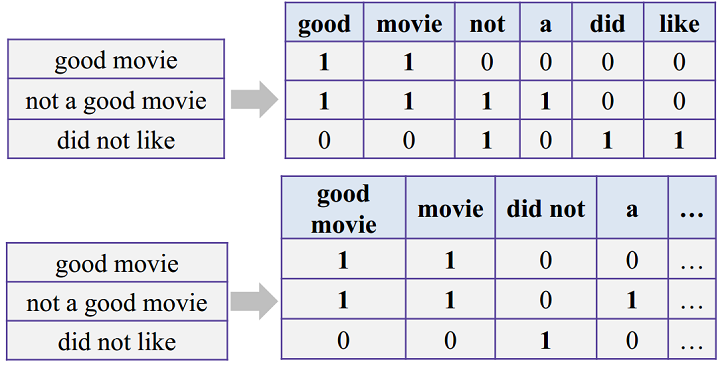
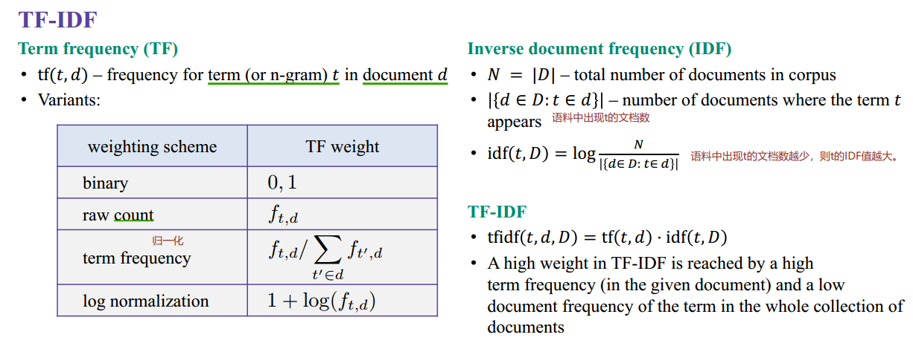
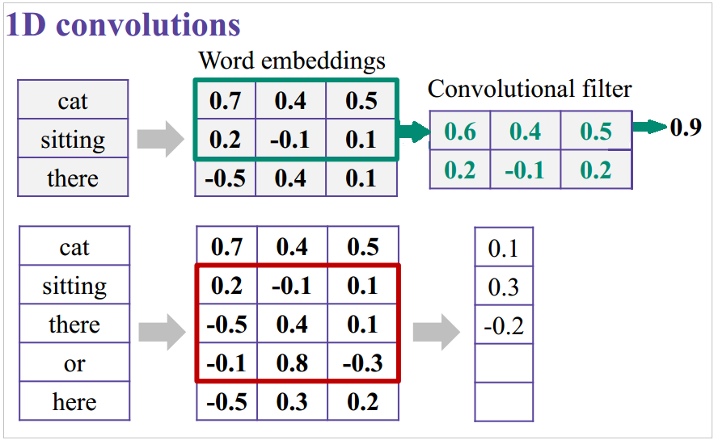

# Week 1
text classification，文本分类

------
### Part I: Introduction to NLP and our course
方法：基于规则的方法，机器学习，深度学习。  


------
### Part II：Text classification
Identify traditional pipeline for text preprocessing and classification.  
了解文本信息/特征的表示方法，并用传统的机器学习方法（线性分类器）做文本分类。

#### 分词(Tokenization)  
将文本(text)看作是词(token)的序列。对中文来说，分词是一个很基本并且重要的课题。  
**在实际应用时，清洗数据、归一化数据、读取和处理数据，都是既耗时又很重要的工作，也是第一步。认识和熟悉数据，对后续模型的优化也一定的帮助。**

#### 提取特征，Feature extraction
- **BOW，Bag of words**，词袋模型，会丢失词序信息  
计算文本中词出现的次数，得到文本的向量表示。
- **n-gram**，N元模型  
n-gram，即当前词和前面(n-1)个词组成一个新的短语。可以保留部分词序信息，但特征数增加。  
实际使用时，会移除频度过高或者过低的特征。比如，停用词（介词等）出现过多，但不是有用的信息。频度过低的词也不需要，否则很容易过拟合。  

- **TF-IDF**，term frequency–inverse document frequency，词频-逆文本频率指数  
移除出现次数过高或过低的特征后，我们得到了中等频度的特征。那么对这些特征而言，有什么更多的信息呢？  
主要思想：如果某个词或短语在一篇文章中出现的频率高，并且在其他文章中很少出现，则认为此词或者短语具有很好的类别区分能力，适合用来分类。  
如果一个词或者短语，在某一个文档出现的次数高，即TF大，而在整个语料中出现的频率低，即IDF大。最后，TF-IDF的值会很大。  
   
- BOW + n-gram + TF-IDF  
结合以上，用TF-IDF代替简单的词频，组合成**BOW + n-gram + TF-IDF**，得到新的文本特征。    
**用sklearn实现特征提取的Python代码**示例如下。
```
from sklearn.feature_extraction.text import TfidfVectorizer
import pandas as pd
texts = [
    "good movie", "not a good movie", "did not like",
    "i like it", "good one"
]
# using default tokenizer in TfidfVectorizer
# 1-gram，2-gram，删除过高和过低词频的词/短语
tfidf = TfidfVectorizer(min_df=2, max_df=0.5, ngram_range=(1, 2))
features = tfidf.fit_transform(texts)
print(pd.DataFrame(
    features.todense(),
    columns=tfidf.get_feature_names()
))
# 特征矩阵
   good movie      like     movie       not
0    0.707107  0.000000  0.707107  0.000000
1    0.577350  0.000000  0.577350  0.577350
2    0.000000  0.707107  0.000000  0.707107
3    0.000000  1.000000  0.000000  0.000000
4    0.000000  0.000000  0.000000  0.000000

```
#### Logistic回归，分类器
情感分析，理论+数据已经准备好，***需要自己搭建一个分类器（to-do）***  
- 数据，[IMDB movie reviews dataset](http://ai.stanford.edu/~amaas/data/sentiment/)
- 理论，tf-idf + ngram + BOW

#### Homework：标签分类
[Homework - Predict tags on StackOverflow with linear models - Notebook](./src/week1/week1-MultilabelClassification_homework.ipynb)  
**Solution，on-going**
 
------
### Part III：Simple deep learning for text classification
用深度学习的方法，实现文本分类。

#### 词向量
one-hot representation，独热向量，稀疏向量/矩阵。  
distributed representation，分布式表示，稠密矩阵。  
相似的词的词向量的余弦距离(cosine distance)小，即夹角小。  
一种方法是直接将预训练好的词向量求平均值，得到文本的向量特征表示；另一种更好的方法是做卷积(n-gram) + 最大池化(max-pooling)，这样可以学习到更复杂的特征，如下图所示，2-gram和3-gram的卷积滤波器做卷积运算。  


#### char-level, word-level， TextCNN
设计用来做文本分类的CNN神经网络结构，第一次提出是2014年，参考文献：[Convolutional Neural Networks for Sentence Classification-Yoon Kim](https://arxiv.org/abs/1408.5882)  
（内心独白，2014年我在哪里？我在做啥???...）  


