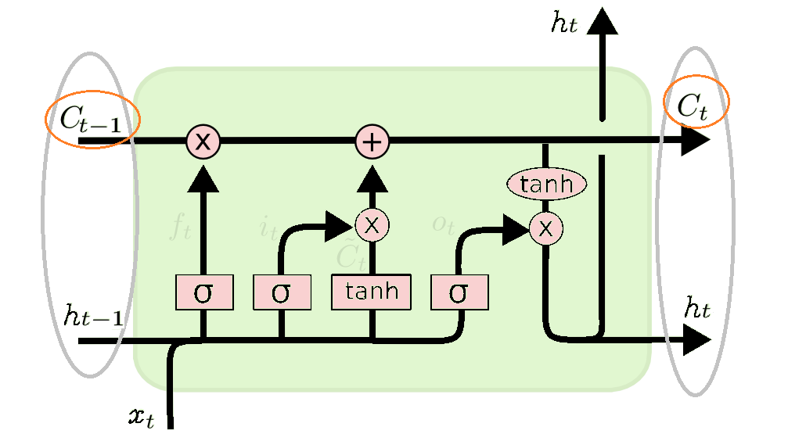

## RNN/LSTM Note
循环神经网络，Recurrent Neutral Network，RNN  
长短时记忆网络，Long Short Term Memory Network, LSTM  

**参考资料：**
- [Understanding LSTM Networks-colah](http://colah.github.io/posts/2015-08-Understanding-LSTMs/)
- [Understanding LSTM Networks-cola-中文翻译版](https://mp.weixin.qq.com/s?__biz=MzI0ODcxODk5OA==&mid=2247485477&idx=1&sn=0d6bd491b593b497eb1f9d92f9afb10d&chksm=e99d3bdcdeeab2ca436750184f999a58b849be41a3a4ec1bd039b531accae124a2297e57ac0e&scene=21#wechat_redirect)
- [零基础入门深度学习(5)-循环神经网络](https://zybuluo.com/hanbingtao/note/541458)，需要的公式推导都在这里！
- [零基础入门深度学习(6)-长短时记忆网络(LSTM)](https://zybuluo.com/hanbingtao/note/581764)，需要的公式推导都在这里！
- [循环神经网络(RNN)模型与前向反向传播算法](https://www.cnblogs.com/pinard/p/6509630.html)，简易版公式推导
- [LSTM模型与前向反向传播算法](https://www.cnblogs.com/pinard/p/6519110.html)，简易版公式推导

## RNN简介
  

一个简单的循环神经网络由输入层、一个隐藏层和一个输出层组成。与全连接神经网络相比，增加了中间的W。
- x是一个向量，它表示**输入层**的值
- s是一个向量，它表示**隐藏层**的值
- U是输入层到隐藏层的**权重矩阵**
- o是一个向量，它表示**输出层**的值
- V是隐藏层到输出层的**权重矩阵**
- **循环神经网络的隐藏层的值s不仅仅取决于当前这次的输入x，还取决于上一次隐藏层的值s，隐藏层即循环层**。权重矩阵 W就是隐藏层上一次的值作为这一次的输入的权重。  

#### 前向传播算法
  
从上图公式可以看出，
- 循环神经网络的输出值与前面历次输入值都有关，所以RNN在处理序列数据上占有优势
- U，V，W，这三个模型参数，在整个RNN网络中是共享的，体现了RNN模型的“循环反馈”思想  
另外，隐藏层的激活函数f一般为tanh，输出的激活函数g一般为softmax

#### 反向传播算法
由于RNN是基于时间的反向传播，所以RNN的反向传播有时也叫做**BPTT**(back-propagation through time)。BPTT和DNN有很大的不同点，即所有的U，W，V在序列的各个位置是共享的，反向传播时更新的是相同的参数。  
具体推导见参考资料。

#### RNN的梯度爆炸和消失问题
原始RNN可以很好的解决短时依赖问题，但无法处理长距离依赖。  
RNN在训练中很容易发生梯度爆炸和梯度消失，这导致训练时梯度不能在较长序列中一直传递下去，从而使RNN无法捕捉到长距离的影响。  
对于梯度爆炸问题，可以设置一个梯度阈值，当梯度超过这个阈值的时候直接截取。  
RNN的变种结构，长短时记忆网络（LTSM）和Gated Recurrent Unit（GRU），可以解决梯度消失的问题。  

**我们将本节提到的RNN为原始RNN，结构抽象图如下所示。**

## LSTM简介
LSTM，一定程度上解决了长时依赖的问题，结构抽象图如下所示，比原始RNN的结构更复杂，LSTM的重复模块中有4个神经网络层，而RNN只有一个简单的层结构。  
原始RNN的隐藏层只有一个状态h，从结构图可以看出LSTM多了一个隐藏状态，新增加的隐藏状态称为单元状态(cell state)，记为C。  

  

在t时刻，LSTM的输入有三个：
- 当前时刻网络的输入值 
- 上一时刻LSTM的输出值 
- 上一时刻的单元状态   

在t时刻，LSTM的输出有两个：
- 当前时刻LSTM输出值 
- 当前时刻的单元状态 

   
#### 门，Gate
  
门是一种选择性让信息通过的方法。LSTM通过门的结构来控制信息的传递。  
它们由一个Sigmoid神经网络层和一个元素级的相乘操作组成。Sigmoid层输出0~1之间的值，每个值表示对应的部分信息是否应该通过。0值表示不允许信息通过，1值表示让所有信息通过。  
**一个LSTM共有3个这种门(即结构图中的σ→⨂)**，来保护和控制单元状态。
- **遗忘门（forget gate）**，它决定了上一时刻的单元状态有多少保留到当前时刻；
- **输入门（input gate）**，它决定了当前时刻网络的输入有多少保存到单元状态；
- **输出门（output gate）**，控制单元状态有多少输出到LSTM的当前输出值。

其中**LSTM用遗忘门和输入门来控制单元状态C，即LSTM结构图中的⊕。**  
并且，**所有的门的系数，均是通过t时刻网络的输入 和t-1时刻网络的输出 来确定的。**

#### 遗忘门
遗忘门和对应的衰减系数的计算。  
如上所述，**过去记忆**的衰减系数由t时刻网络的输入 和t-1时刻网络的输出 共同决定。
  
  

#### 输入门
当前学习到的单元状态为 。  
**当前时刻学习到的记忆**的衰减系数也是由t时刻网络的输入 和t-1时刻网络的输出 共同决定。
  

#### 单元状态的更新
将t-1时刻的记忆乘以遗忘门的衰减系数，加上t时刻学习到的输入记忆乘以输入门的衰减系数，最终得到了t时刻的记忆，即单元状态。  
当前时刻的单元状态，由上一时刻的单元状态按元素乘以遗忘门，再用当前输入的单元状态按元素乘以输入门，再将两个积加和产生的。
这样，我们就把LSTM关于当前的记忆和长期的记忆组合在一起，形成了新的单元状态。由于遗忘门的控制，它可以保存很久以前的信息，由于输入门的控制，它又可以避免当前无关紧要的内容进入记忆。

#### 输出门
t时刻的网络输出，由输出门和当前时刻t更新后的单元状态(记忆)共同确定的。  
其中**输出门对应的当前时刻更新后的记忆的衰减系数**还是由t时刻网络的输入 和t-1时刻网络的输出 共同决定。  

## GRU (Gated Recurrent Unit)
GRU是LSTM的变体，2014年被提出。它对LSTM做了很多简化，同时却保持着和LSTM相同的效果。  

GRU对LSTM做了两个大改动，输入输出变得特别简单：
- 将输入门、遗忘门、输出门变为两个门：更新门（Update Gate）和重置门（Reset Gate）  
GRU将遗忘门和输入门合并成为单一的“更新门(Update Gate)”。
- 将单元状态(Cell State)与输出(Hidden State)合并为一个状态  

■■■
