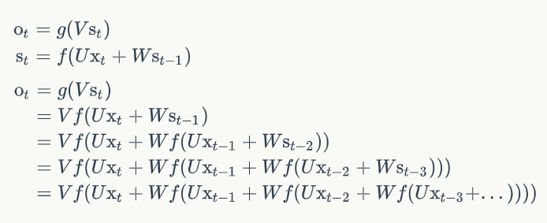
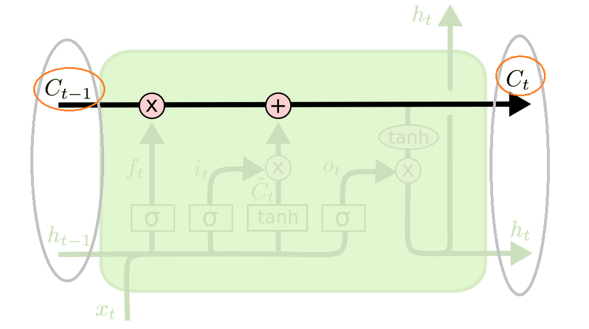

## RNN/LSTM Note
循环神经网络，Recurrent Neutral Network，RNN  
长短时记忆网络，Long Short Term Memory Network, LSTM  

**参考资料：**
- [Understanding LSTM Networks-colah](http://colah.github.io/posts/2015-08-Understanding-LSTMs/)
- [Understanding LSTM Networks-cola-中文翻译版](https://mp.weixin.qq.com/s?__biz=MzI0ODcxODk5OA==&mid=2247485477&idx=1&sn=0d6bd491b593b497eb1f9d92f9afb10d&chksm=e99d3bdcdeeab2ca436750184f999a58b849be41a3a4ec1bd039b531accae124a2297e57ac0e&scene=21#wechat_redirect)
- [零基础入门深度学习(5)-循环神经网络](https://zybuluo.com/hanbingtao/note/541458)，需要的公式推导都在这里！
- [零基础入门深度学习(6)-长短时记忆网络(LSTM)](https://zybuluo.com/hanbingtao/note/581764)，需要的公式推导都在这里！
- [循环神经网络(RNN)模型与前向反向传播算法](https://www.cnblogs.com/pinard/p/6509630.html)，简易版公式推导
- [LSTM模型与前向反向传播算法](https://www.cnblogs.com/pinard/p/6519110.html)，简易版公式推导

## RNN简介
  

- 一个简单的循环神经网络由输入层、一个隐藏层和一个输出层组成。与全连接神经网络相比，增加了中间的W。
- x是一个向量，它表示**输入层**的值
- s是一个向量，它表示**隐藏层**的值
- U是输入层到隐藏层的**权重矩阵**
- o是一个向量，它表示**输出层**的值
- V是隐藏层到输出层的**权重矩阵**
- **循环神经网络的隐藏层的值s不仅仅取决于当前这次的输入x，还取决于上一次隐藏层的值s**。权重矩阵 W就是隐藏层上一次的值作为这一次的输入的权重。  
隐藏层即循环层。

#### 前向传播算法
  
从上图公式可以看出，
- 循环神经网络的输出值与前面历次输入值都有关，所以RNN在处理序列数据上占有优势
- U，V，W，这三个模型参数，在整个RNN网络中是共享的，体现了RNN模型的“循环反馈”思想  
另外，隐藏层的激活函数f一般为tanh，输出的激活函数g一般为softmax

#### 反向传播算法
由于RNN是基于时间的反向传播，所以RNN的反向传播有时也叫做**BPTT**(back-propagation through time)。BPTT和DNN有很大的不同点，即所有的U，W，V在序列的各个位置是共享的，反向传播时更新的是相同的参数。  
具体推导见参考资料。

#### RNN的梯度爆炸和消失问题
原始RNN可以很好的解决短时依赖问题，但无法处理长距离依赖。  
RNN在训练中很容易发生梯度爆炸和梯度消失，这导致训练时梯度不能在较长序列中一直传递下去，从而使RNN无法捕捉到长距离的影响。  
对于梯度爆炸问题，可以设置一个梯度阈值，当梯度超过这个阈值的时候直接截取。  
RNN的变种结构，长短时记忆网络（LTSM）和Gated Recurrent Unit（GRU），可以解决梯度消失的问题。  

**我们将本节提到的RNN为原始RNN，结构抽象图如下。**

## LSTM简介
LSTM，一定程度上解决了长时依赖的问题，结构抽象图如下所示。比原始RNN的结构更复杂。
  

- 遗忘门
  

- 输入门
  

- 输出门
  

   
  
