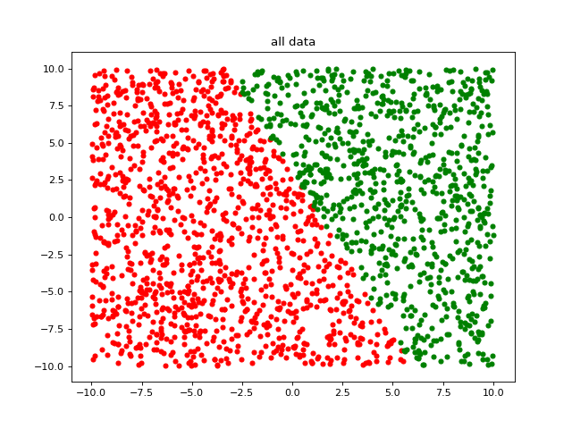
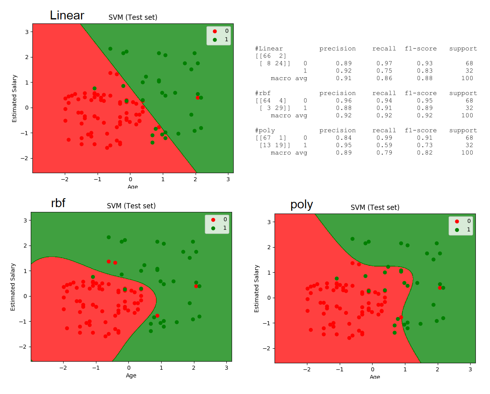

## 三种方法实现SVM
- 用Python实现，代码参考： [lihang_book_algorithm](https://github.com/huankiki/lihang_book_algorithm)，参考了经典书：李航《统计学习方法》
- 用Python的Sklearn库实现，代码参考： [100-Days-Of-ML-Code](https://github.com/Avik-Jain/100-Days-Of-ML-Code) 
- 对libsvm的Python封装， 参考： [LIBSVM -- A Library for Support Vector Machines](https://www.csie.ntu.edu.tw/~cjlin/libsvm/)、  [karpathy/EigenLibSVM](https://github.com/karpathy/EigenLibSVM)


## SVM with Python
生成线性可分数据，分别用两种不同的参数设置训练和预测。  
  
```python
svm = SVM(kernel='linear', epsilon=0.001)  ##默认参数设置
svm = SVM(kernel='poly', epsilon=0.0001)
python2 svm.py
```

结果如下：
```text
# svm(linear)
[[248  35]
 [ 91 292]]
              precision    recall  f1-score   support

          -1       0.73      0.88      0.80       283
           1       0.89      0.76      0.82       383

   micro avg       0.81      0.81      0.81       666
   macro avg       0.81      0.82      0.81       666
weighted avg       0.82      0.81      0.81       666


# svm(poly)
[[283   0]
 [ 62 321]]
              precision    recall  f1-score   support

          -1       0.82      1.00      0.90       283
           1       1.00      0.84      0.91       383

   micro avg       0.91      0.91      0.91       666
   macro avg       0.91      0.92      0.91       666
weighted avg       0.92      0.91      0.91       666
```

## SVM with Sklearn
实践的第一个分类是POI分类（文本分类），当时查资料只用半天的时间，第一次用Python-Sklearn搭建好分类器。  
并尝试了LinearSVC、SVC等模型，ngram、tf-idf等特征。而且计算速度非常快。  
以下为**官方文档**，可以仔细研究，特别是训练学习到的参数，比如：coef_、intercept_等。可以挖掘的信息很多。
- [sklearn.svm.LinearSVC](https://scikit-learn.org/stable/modules/generated/sklearn.svm.LinearSVC.html#sklearn.svm.LinearSVC)  
Linear Support Vector Classification, kernel=’linear’
- [sklearn.svm.SVC](https://scikit-learn.org/stable/modules/generated/sklearn.svm.SVC.html#sklearn.svm.SVC)  
C-Support Vector Classification, based on **libsvm**.  
kernel: ‘linear’, ‘poly’, **‘rbf’(默认)**, ‘sigmoid’, ‘precomputed’

**分别用不同的核函数训练和测试，linear、rbf、poly，结果如下。**  
rbf >= linear > poly  



## 小结
- **最好用的工具是 Python-Sklearn，推荐！**  
不管是算法、数据处理、特征提取、性能评估，都很容易上手，只要准备好数据即可。  
对于文本数据，sklearn的特征可以有多种，ngram、 TF-IDF等，可以多多参考用户手册。  
但缺陷是sklearn是实现各种机器学习算法的工具，无法实现深度学习的方法。
- 对SMO和SVM的理论，需要进一步：**1，做笔记+实践，深入理解；2，和深度学习的方法做对比**
