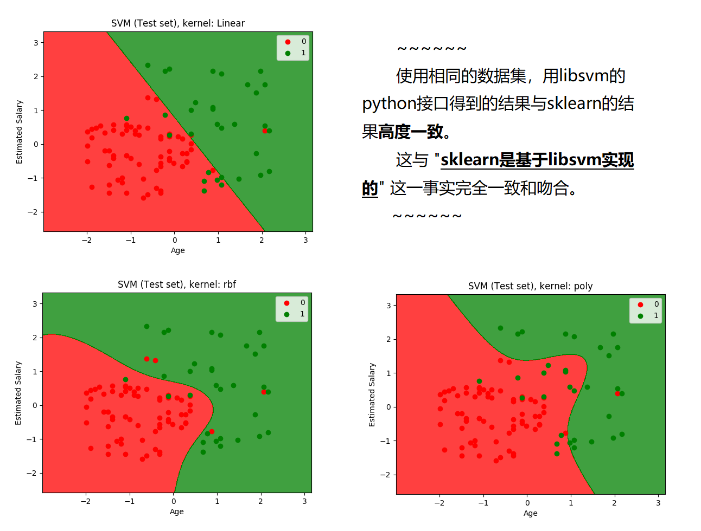

## 三种方法实现SVM
- 用Python实现，代码参考： [lihang_book_algorithm](https://github.com/huankiki/lihang_book_algorithm)，参考了经典书：李航《统计学习方法》
- 用Python的Sklearn库实现，代码参考： [100-Days-Of-ML-Code](https://github.com/Avik-Jain/100-Days-Of-ML-Code) 
- 对libsvm的Python封装， 参考： [LIBSVM -- A Library for Support Vector Machines](https://www.csie.ntu.edu.tw/~cjlin/libsvm/)、  [karpathy/EigenLibSVM](https://github.com/karpathy/EigenLibSVM)


## SVM with Python
生成线性可分数据，分别用两种不同的参数设置训练和预测。  
  
```python
svm = SVM(kernel='linear', epsilon=0.001)  ##默认参数设置
svm = SVM(kernel='poly', epsilon=0.0001)
python2 svm.py
```

结果如下：
```text
# svm(linear)
[[248  35]
 [ 91 292]]
              precision    recall  f1-score   support

          -1       0.73      0.88      0.80       283
           1       0.89      0.76      0.82       383

   micro avg       0.81      0.81      0.81       666
   macro avg       0.81      0.82      0.81       666
weighted avg       0.82      0.81      0.81       666


# svm(poly)
[[283   0]
 [ 62 321]]
              precision    recall  f1-score   support

          -1       0.82      1.00      0.90       283
           1       1.00      0.84      0.91       383

   micro avg       0.91      0.91      0.91       666
   macro avg       0.91      0.92      0.91       666
weighted avg       0.92      0.91      0.91       666
```

## SVM with Sklearn
去年本人实现的第一个分类器是POI分类（文本分类），当时只用半天的时间查资料，第一次用Python-Sklearn搭建完成一个分类器。  
并且尝试了LinearSVC、SVC等模型，ngram、tf-idf等特征。而且计算速度非常快。  
以下为**官方文档**，可以仔细研究，特别是训练学习到的参数，比如：coef_、intercept_等。可以挖掘的信息有很多。
- [sklearn.svm.LinearSVC](https://scikit-learn.org/stable/modules/generated/sklearn.svm.LinearSVC.html#sklearn.svm.LinearSVC)  
Linear Support Vector Classification, kernel=’linear’
- [sklearn.svm.SVC](https://scikit-learn.org/stable/modules/generated/sklearn.svm.SVC.html#sklearn.svm.SVC)  
C-Support Vector Classification, based on **libsvm**.  
kernel: ‘linear’, ‘poly’, **‘rbf’(默认)**, ‘sigmoid’, ‘precomputed’

**分别用不同的核函数训练和测试，linear、rbf、poly，结果如下。**  
**rbf >= linear > poly**  


## SVM with libsvm
上面提到了sklearn.svm.SVC也是基于libsvm的实现。  
先来膜拜一下大神Andrej karpathy，李飞飞的高徒，斯坦福博士。他曾经用C++封装libsvm，不仅是理论大神，还会编代码。  
言归正传，阅读[libsvm的官网](https://www.csie.ntu.edu.tw/~cjlin/libsvm/)， libsvm的Python接口已经在包含在版本2.33中，现在已经更新到3.23。
> A python interface has been included in LIBSVM since version 2.33.
- [libsvm-guide](https://www.csie.ntu.edu.tw/~cjlin/papers/guide/guide.pdf)
- [Github-libsvm-python-interface](https://github.com/cjlin1/libsvm/tree/master/python)
- -t kernel_type : set type of kernel function (default 2)  
	0 -- linear: u'*v  
	1 -- polynomial: (gamma*u'*v + coef0)^degree  
	2 -- radial basis function: exp(-gamma*|u-v|^2)  
	3 -- sigmoid: tanh(gamma*u'*v + coef0)  
	4 -- precomputed kernel (kernel values in training_set_file)  
	
#### Step1，下载libsvm project，编译
```bash
git clone https://github.com/cjlin1/libsvm.git
cd libsvm
make
cd python
make
```
将编译好的libsvm.so.2放到目录~/.local/lib/python3.5。  
将python目录下的svm.py和svmutil.py拷贝到~/.local/lib/python3.5/site-packages。  

将当前目录从libsvm/python改变到其他目录，检查安装是否成功，没有报错即安装成功。
```python
python3
>>> import sys
## 这一步必不可少
>>> sys.path.append('home/username/Downloads/libsvm/python')
>>> from svmutil import *
```

#### Step2，采用与sklearn相同的数据集，训练、预测
采用与上一节sklearn相同的数据集，用libsvm的python接口，做训练和预测。  
核函数分别选择linear(-t 0)、poly(-t 1)和rbf(-t 2)。
```text
python3 libsvm_python_interface.py
```
结果如下所示。  


```python
## linear，Accuracy = 89% (89/100) (classification)
[[66  2]
 [ 9 23]]
              precision    recall  f1-score   support
           0       0.88      0.97      0.92        68
           1       0.92      0.72      0.81        32
   micro avg       0.89      0.89      0.89       100


## poly，Accuracy = 86% (86/100) (classification)
[[67  1]
 [13 19]]
              precision    recall  f1-score   support
           0       0.84      0.99      0.91        68
           1       0.95      0.59      0.73        32
   micro avg       0.86      0.86      0.86       100


## rbf，Accuracy = 93% (93/100) (classification)
[[64  4]
 [ 3 29]]
              precision    recall  f1-score   support
           0       0.96      0.94      0.95        68
           1       0.88      0.91      0.89        32
   micro avg       0.93      0.93      0.93       100
```


P.S.  为了得视图化的结果，废了老大劲(2 hours，但成就感满满)，主要是因为libsvm的数据格式与numpy有很大不同，所以要转换（具体实现请看代码）。  
- 1, 如何画出上图中的效果，为什么要用ravel，参看：[here](https://stackoverflow.com/questions/35811273/scikit-learn-and-data-visusalisation-why-do-i-have-to-use-ravel-when-i-use-pred)
- 2, bug: AttributeError: 'bool' object has no attribute 'mean'  
最初使用了`np.ones((point_num, 1)`, 这是错误的，创建了二维矩阵，而不是一维数组，所以一直报错。  
正确使用如下： `Y12 = np.ones((point_num, ), dtype=np.float64)`
- 3, bug： AttributeError: 'list' object has no attribute 'reshape'  
libsvm的预测结果是list， 而非numpy array，所以需要转换： `np.array(Y_pred)`


## 小结
- **最好用的工具是 Python-Sklearn，推荐！**  
不管是算法、数据处理、特征提取、性能评估，都很容易上手，只要准备好数据即可。  
对于文本数据，sklearn的特征可以有多种，ngram、 TF-IDF等，可以多多参考用户手册。  
但缺陷是sklearn是实现各种机器学习算法的工具，无法实现深度学习的方法。
- 对SVM和SMO的理论，需要进一步：
    - **1，做笔记，推公式，深入理解**
    - **2，更多实践（文本分类），同时与深度学习的方法(LSTM)做对比**
