# Week 1

[TOC]

##Week 1 Overview (from [Coursera website](https://www.coursera.org/learn/text-mining/supplement/BlYwq/week-1-overview))
During this week's lessons, you will learn the overall course design, an overview of natural language processing techniques and text representation, which are the foundation for all kinds of text-mining applications, and word association mining with a particular focus on mining one of the two basic forms of word associations (i.e., paradigmatic relations).

###Goals and Objectives
After you actively engage in the learning experiences in this module, you should be able to:
- Explain some basic concepts in natural language processing.
- Explain different ways to represent text data.
- Explain the two basic types of word associations and how to mine paradigmatic relations from text data.

	
###Guiding Questions
Develop your answers to the following guiding questions while watching the video lectures throughout the week.
> - What does a computer have to do in order to understand a natural language sentence?
> - What is ambiguity?
> - Why is natural language processing (NLP) difficult for computers?
> - What is bag-of-words representation?
> - Why is this word-based representation more robust than representations derived from syntactic and semantic analysis of text?
> - What is a paradigmatic relation?
> - What is a syntagmatic relation?
> - What is the general idea for discovering paradigmatic relations from text?
> - What is the general idea for discovering syntagmatic relations from text?
> - Why do we want to do Term Frequency Transformation when computing similarity of context?
> - How does BM25 Term Frequency transformation work?
> - Why do we want to do Inverse Document Frequency (IDF) weighting when computing similarity of context?

###Additional Readings and Resources
The following readings are optional:
- C. Zhai and S. Massung, Text Data Management and Analysis: A Practical Introduction to Information Retrieval and Text Mining. ACM and Morgan & Claypool Publishers, 2016. Chapters 1-4, Chapter 13.
- Chris Manning and Hinrich Schütze, Foundations of Statistical Natural Language Processing. MIT Press. Cambridge, MA: May 1999. Chapter 5 on collocations.
- Chengxiang Zhai, Exploiting context to identify lexical atoms: A statistical view of linguistic context. Proceedings of the International and Interdisciplinary Conference on Modelling and Using Context (CONTEXT-97), Rio de Janeiro, Brazil, Feb. 4-6, 1997, pp. 119-129.
- Shan Jiang and ChengXiang Zhai, Random walks on adjacency graphs for mining lexical relations from big text data. Proceedings of IEEE BigData Conference 2014, pp. 549-554.

###Key Phrases and Concepts
Keep your eyes open for the following key terms or phrases as you complete the readings and interact with the lectures. These topics will help you better understand the content in this module.
- Part of speech tagging
- Syntactic analysis
- Semantic analysis
- Ambiguity
- Text representation, especially bag-of-words representation
- Context of a word; context similarity
- Paradigmatic relation
- Syntagmatic relation

## Note (March 6, 2019)
### Part1: Overview Text Mining and Analytics
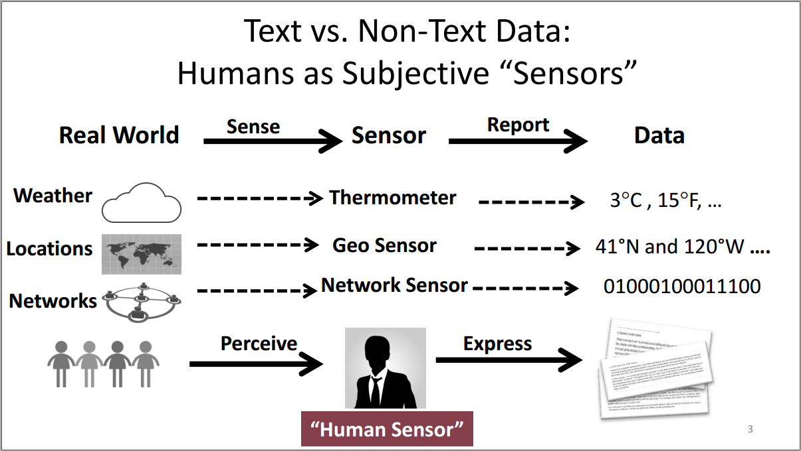
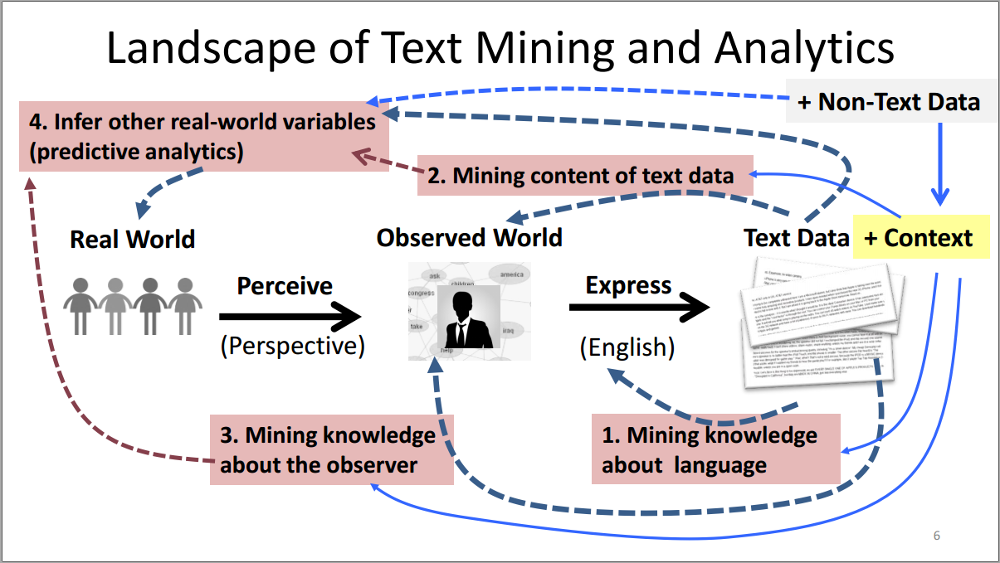
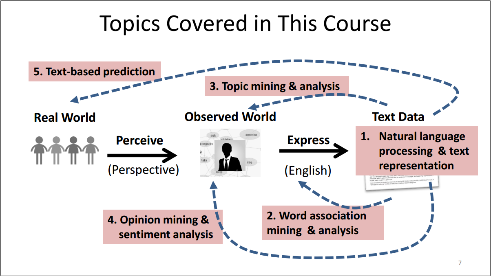

- - -
### Part2: Natural Language Content Analysis
NLP Is Difficult! NLP is the foundation for text mining.
statistical methods in NLP as the basis.
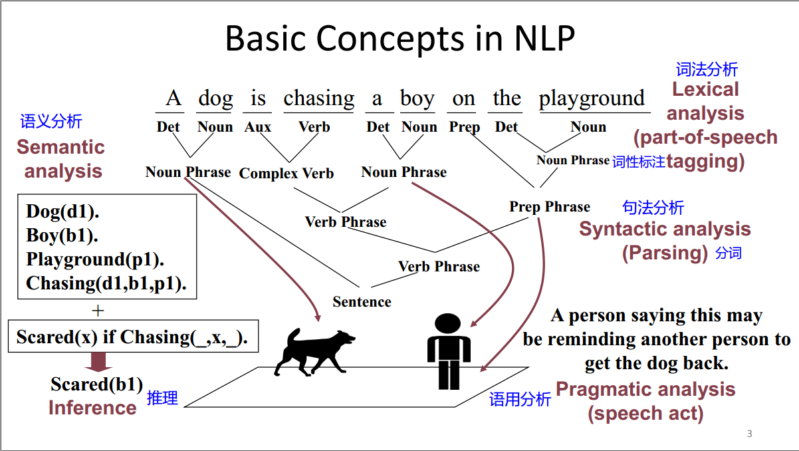
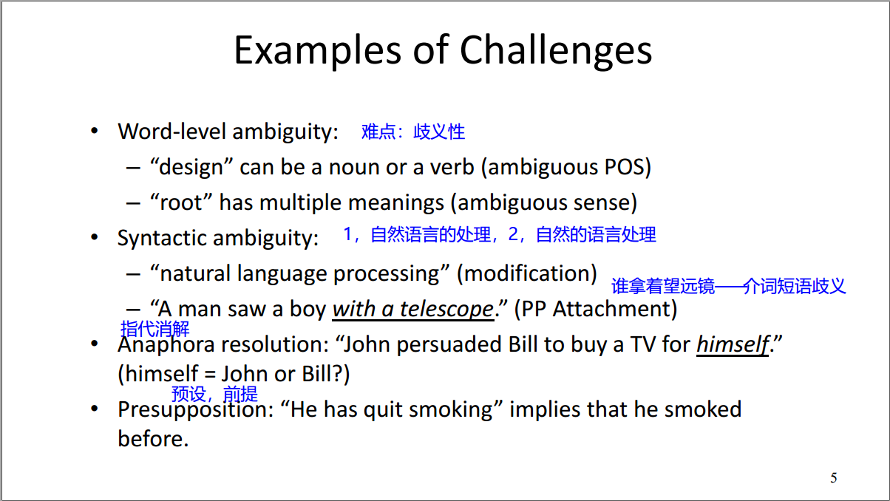

- - -
### Part3: Text Representation，文本表示
**Multiple ways** of representing text: string, words, syntactic structures, entity-relation graphs, predicates…
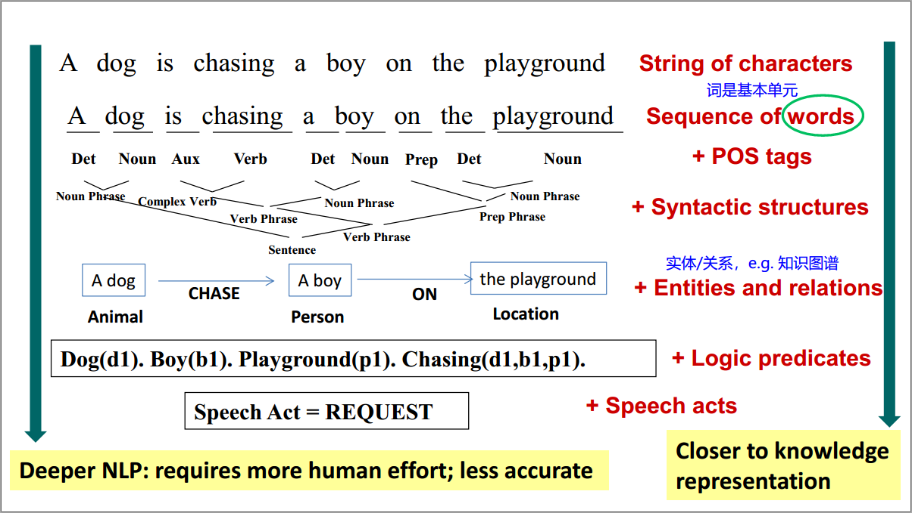
This course focuses on **word-based representation**
- **General and robust**: applicable to any natural language
- **No/little manual effort**
- **“Surprisingly” powerful** for many applications (not all!)
- **Can be combined** with more sophisticated representations

- - -
### Part4: Word Association Mining and Analysis
What, Why, How?
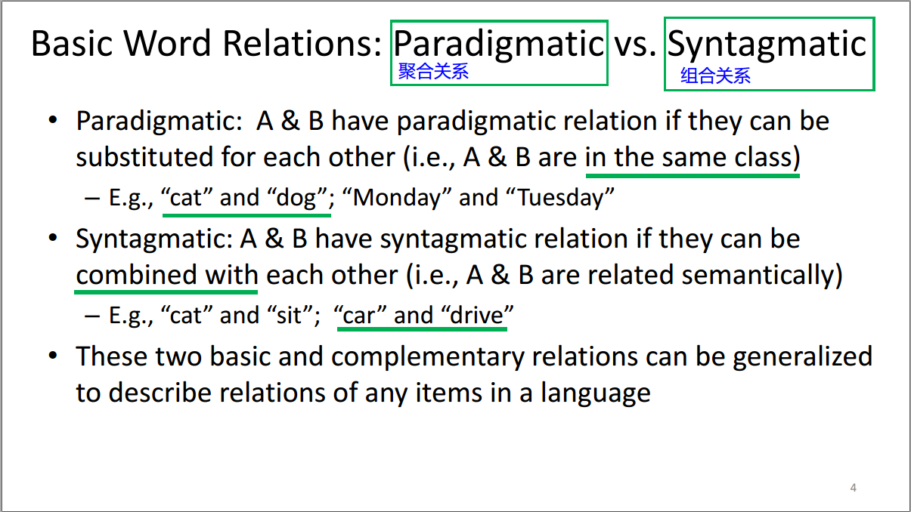
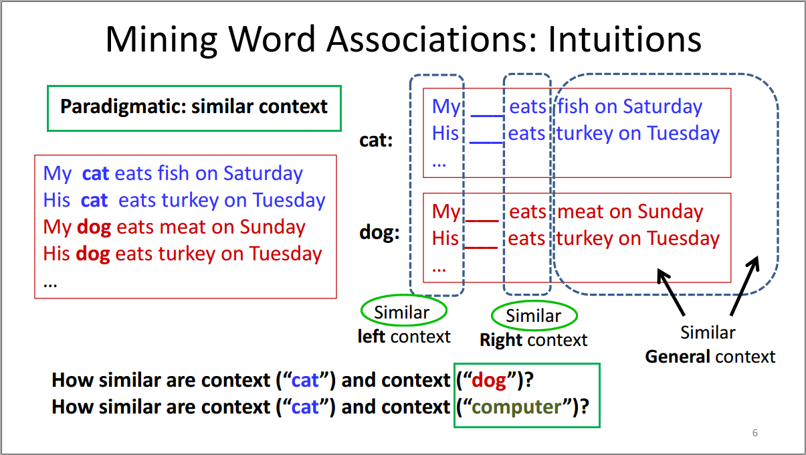
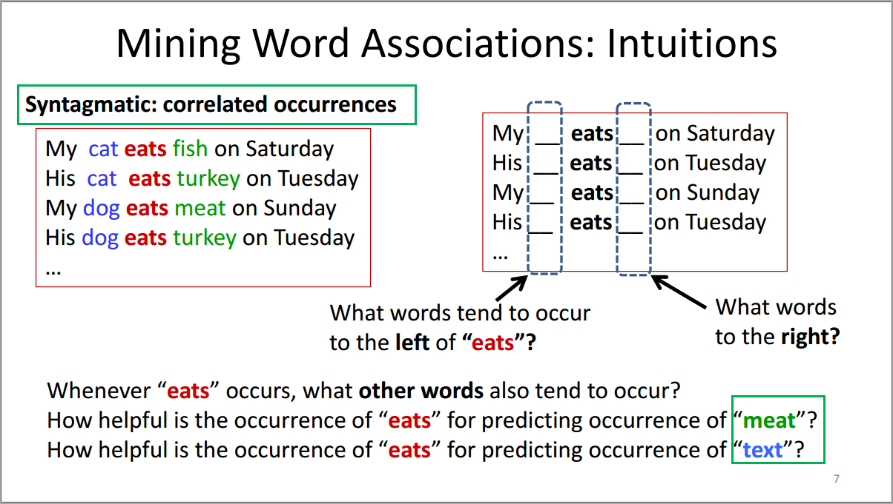
两种关系：聚合关系和组合关系。

#####Paradigmatic，聚合关系，比如"cat"和"dog"
- Represent each word by its context
- Compute context similarity
- Words with **high context similarity** likely have paradigmatic relation

#####Syntagmatic，组合关系，比如"car"和"drive"
- Count how many times two words occur together in a context (e.g.,
sentence or paragraph)
- Compare their co-occurrences with their individual occurrences
- Words with **high co-occurrences but relatively low individual occurrences**
likely have syntagmatic relation

- - -
### Part5: Paradigmatic Relation Discovery, 寻找聚合关系的方法

#####(1) 将词的语境当做伪文档，即词袋BOW，语境越相似，两个词的相似度越高
High sim(word1, word2) >> word1 and word2 are paradigmatically related

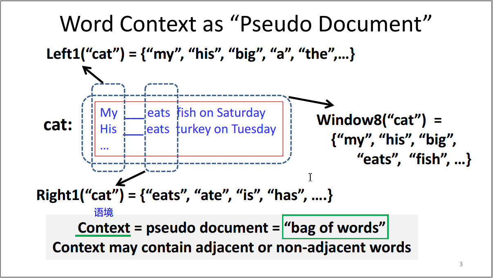

#####(2) 一种方法是计算文档的词向量的相似度，比如EOWC。
算法涉及两个问题：如何计算文档的向量、如何计算两个向量的相似度。
- 1. How to compute each vector?
- 2.  Sim(d1,d2)=?

EOWC的方式为：文档词频向量为特征向量，向量的点积为相似度。

#####(3) EOWC有两个缺点，所以分别引入TF和IDF
两个缺点：
- 常见词的贡献大于特定的词。引入TF，可以减小高频词的贡献
- 每个词的权重相同，包括常见但没有太多意义的介词。引入IDF，可以"惩罚"常见词
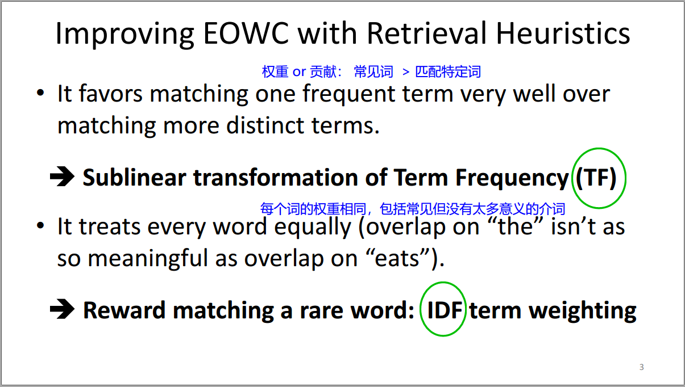
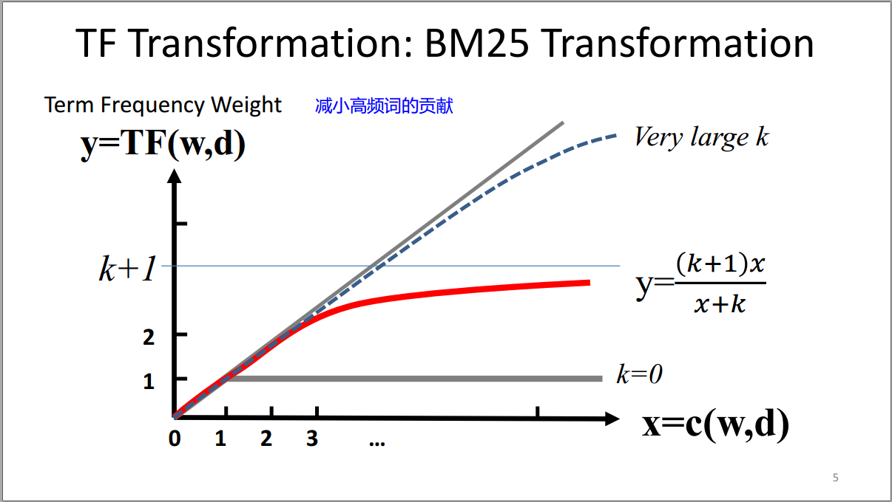
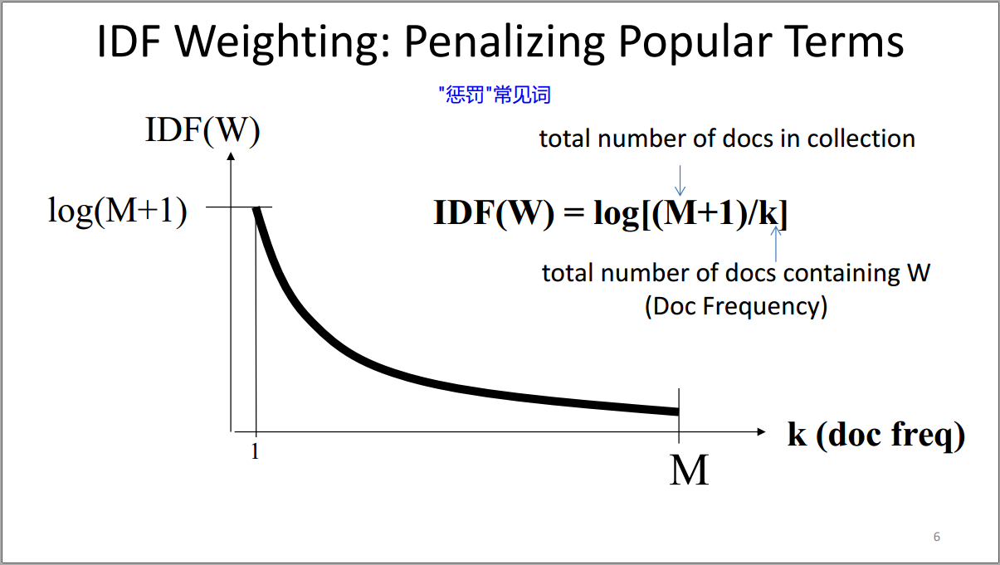

#####(4) BM25 + IDF weighting，当前最好的文本检索算法
之前简单看过solr的源码，使用的就是BM25
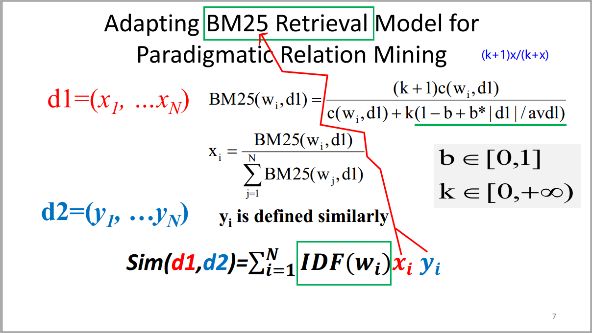

#####(5) 小结：Main idea for discovering paradigmatic relations:
- Collecting the context of a candidate word to form a pseudo
document (bag of words)
- Computing similarity of the corresponding context documents of two
candidate words
- Highly similar word pairs can be assumed to have paradigmatic
relations

* * *

